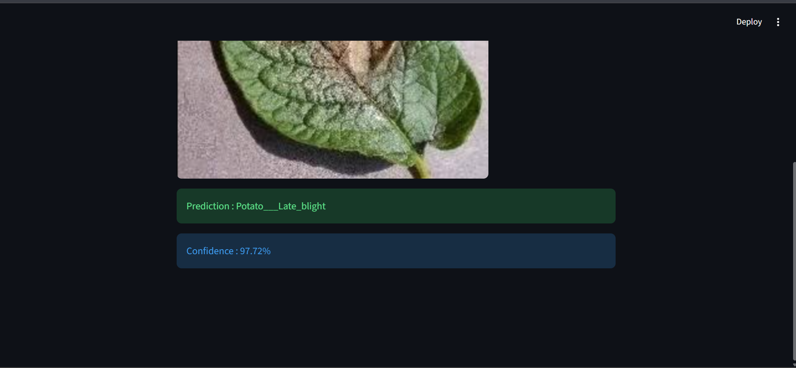

#  Plant Disease Detection from Leaf Images

##  Project Overview

Plant Disease Detection is a Deep Learning project that classifies plant leaf diseases using a Convolutional Neural Network (CNN). The model is trained on the PlantVillage dataset and deployed using Streamlit, allowing users to upload a leaf image and receive the predicted disease along with the confidence score.

---

##  Features

-  Detects plant diseases from leaf images
-  Upload leaf images through a Streamlit web interface
-  CNN model built using TensorFlow and Keras
-  Displays prediction with confidence score
-  Generates training accuracy graph
-  Simple and user-friendly interface

---

##  Technologies Used

- Python
- TensorFlow
- Keras
- OpenCV
- NumPy
- Matplotlib
- Streamlit

---

##  Dataset

**Dataset:** PlantVillage

The PlantVillage dataset contains over 20,000 plant leaf images belonging to 15 healthy and diseased classes. The images are used to train and evaluate the CNN model for disease classification.

---

## 📁 Project Structure

```text
Plant-Disease-Detection/
│
├── dataset/
│   └── PlantVillage/
│
├── models/
│   ├── plant_model.h5
│   └── class_names.json
│
├── uploads/
│
├── screenshots/
│   ├── image.png
│   ├── image1.png
│   ├── image2.png
│   └── image3.png
│
├── train.py
├── predict.py
├── app.py
├── requirements.txt
├── README.md
└── accuracy_plot.png
```

---

##  Installation

### 1. Clone the Repository

```bash
git clone https://github.com/sujibaskar/Plant-Disease-Detection.git
```

### 2. Navigate to the Project Folder

```bash
cd plant
```

### 3. Install Required Libraries

```bash
pip install -r requirements.txt
```

---

##  Run the Project

### Train the CNN Model

```bash
python train.py
```

### Launch the Streamlit Application

```bash
python -m streamlit run app.py
```

The application will open automatically in your browser.

---

#  Output Screenshots

##  Home Screen


---

##  Disease Prediction Example 1


---

##  Disease Prediction Example 2



---

##  Model Accuracy


---

## Model Performance

| Parameter | Value |
|-----------|-------|
| Model | Convolutional Neural Network (CNN) |
| Dataset | PlantVillage |
| Number of Classes | 15 |
| Image Size | 128 × 128 |
| Validation Split | 20% |
| Optimizer | Adam |
| Loss Function | Categorical Crossentropy |
| Framework | TensorFlow / Keras |

---

##  Sample Prediction

| Input Image | Predicted Disease | Confidence |
|-------------|-------------------|------------|
| Potato Leaf | Potato Late Blight | 97.97% |

---

## 📈 Results

- Successfully classified 15 plant disease classes.
- Developed a CNN model for plant disease recognition.
- Built an interactive Streamlit web application.
- Displays disease prediction with confidence score.
- Generates training accuracy visualization after model training.


