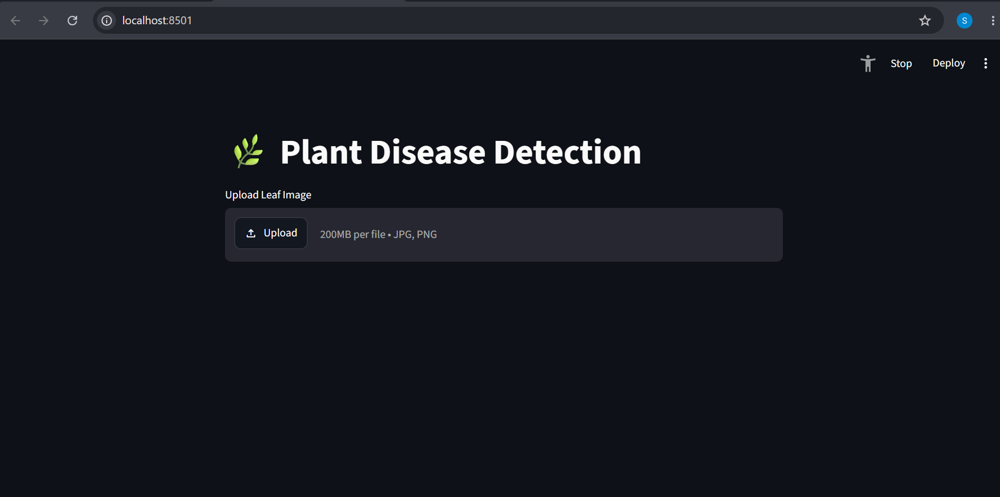
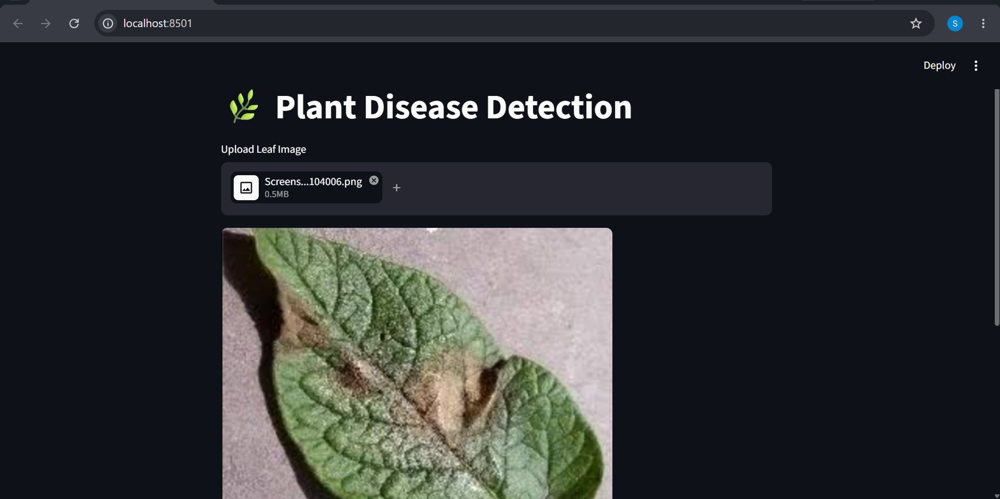
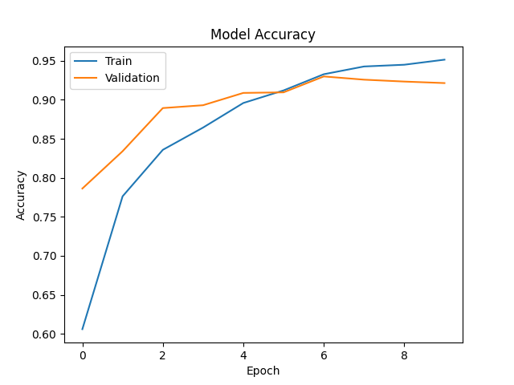

# 🌿 Plant Disease Detection from Leaf Images

## 📌 Project Overview

This project detects plant diseases from leaf images using a Convolutional Neural Network (CNN). The model is trained on the PlantVillage dataset and deployed using Streamlit, allowing users to upload a leaf image and receive the predicted disease along with the confidence score.

---

## 🚀 Features

- Detects plant diseases from leaf images
- Image upload through Streamlit
- CNN model built using TensorFlow/Keras
- Displays prediction and confidence score
- Training accuracy graph
- Easy-to-use web interface

---

## 🛠 Technologies Used

- Python
- TensorFlow
- Keras
- OpenCV
- NumPy
- Matplotlib
- Streamlit

---

## 📂 Dataset

**PlantVillage Dataset**

The dataset contains thousands of leaf images belonging to different healthy and diseased plant classes.

---

## 📁 Project Structure

```
Plant-Disease-Detection
│
├── dataset/
│   └── PlantVillage/
│
├── models/
│   ├── plant_model.h5
│   └── class_names.json
│
├── uploads/
│
├── screenshots/
│   ├── home.png
│   ├── prediction.png
│   └── accuracy_plot.png
│
├── train.py
├── predict.py
├── app.py
├── requirements.txt
├── README.md
└── accuracy_plot.png
```

---

## ⚙ Installation

Clone the repository

```bash
git clone https://github.com/yourusername/Plant-Disease-Detection.git
```

Go to the project folder

```bash
cd Plant-Disease-Detection
```

Install required packages

```bash
pip install -r requirements.txt
```

---

## ▶ Run the Project

### Train the Model

```bash
python train.py
```

### Launch the Streamlit App

```bash
python -m streamlit run app.py
```

---

# 📸 Output Screenshots

## Home Screen



---

## Disease Prediction


(screenshots/image2.png)


---

## Model Accuracy




---

## 📈 Model Performance

- Total Classes : 15
- Image Size : 128 × 128
- CNN Architecture
- Validation Split : 20%
- Optimizer : Adam
- Loss Function : Categorical Crossentropy

---

## Sample Prediction

| Input Image | Prediction | Confidence |
|-------------|------------|------------|
| Potato leaf | Potato Late Blight | 97.97% |

---


